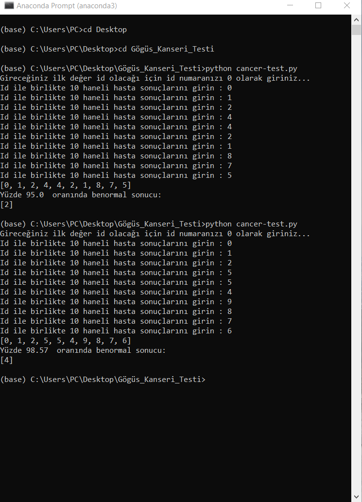
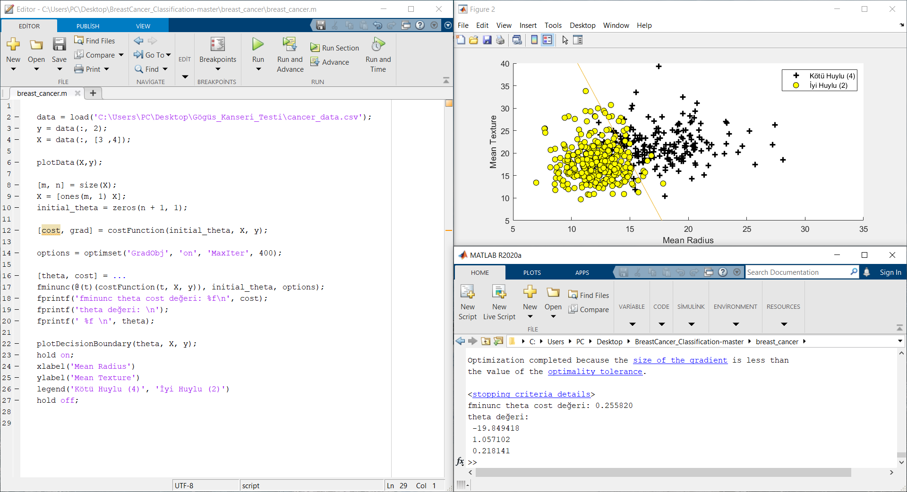

# KNN_breast_cancer_artificial_intelligence

# To Run Artificial Iintelligence
## It is an artificial intelligence study that gives results with 98 percent accuracy in the detection of breast cancer with the help of the KNN algorithm. The project was completed in October 2020. You may get errors on the code due to updates to the libraries in the future. It will be enough to change the library paths.
#### 4 --> Malignant (Kötü Huylu Kanser Hücresi)
#### 2 --> Benign (İyi Huylu Kanser Hücresi)


### Run
 ```sh
$ python cancer-test.py
```

# To Run MATLab Logistic Regression

### Run
```sh
$ run breast_cancer.m
```

## In this project, UCI Machine Learning Repository  data were used to train artificial intelligence.

- UCI for breast cancer : [https://archive.ics.uci.edu/ml/datasets/breast+cancer+wisconsin+(original)]
