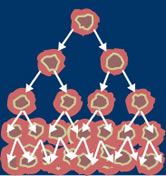

# Breast cancer detection with KNN algorithm 
 

# K-Nearest Neighbour Classification
  The k-nearest neighborhood (KNN) algorithm is one of the easy-to-implement supervised learning algorithms. It is used in the solution of both classification and regression problems, and is used in industry to solve classification problems in industry.


In pattern recognition, the K-Nearest Neighbor algorithm (K-NN) is a non-parametric method used
for classification and regression. In both cases, the input consists of the K closest training examples in the feature
space. K-NN is a type of instance-based learning.
In K-NN Classification, the output is a class membership. Classification is done by a majority vote of
neighbours. If K = 1, then the class is single nearest neighbour [6]. 


KNN algorithms were proposed by T. M. Cover and P. E. Hart in 1967. The algorithm is used by making use of data from a sample set whose classes are known. The distance of the new data to be included in the sample data set is calculated according to the existing data and k number of close neighborhoods are checked. Generally, 3 types of distance functions are used for distance calculations:
- "Euclidean" Distance
- Distance to "Manhattan"
- "Minkowski" is the Distance.

KNN; It is one of the most popular machine learning algorithms because it is resistant to old, simple and noisy training data. However, it also has a disadvantage. For example, it requires a large amount of memory space when used for large data, since it stores all states while calculating distance.


#### Steps of the KNN algorithm:
```sh
$ First, the k parameter is determined. This parameter is the number of neighbors closest to a given point. For example: Let k = 2. In this case, classification will be made according to the closest 2 neighbors.
$ The distance of the new data to be included in the sample data set is calculated one by one according to the existing data. With the help of the relevant distance functions.
$ The nearest neighbors from the relevant distances are considered. It is assigned to the class of k neighbors or neighbors according to the attribute values.
$ The selected class is considered to be the class of the observation value expected to be estimated. In other words, the new data is labeled.
```


# To Run MATLab Logistic Regression


### Run
```sh
$ run breast_cancer.m
```

# To Run Artificial Iintelligence
## It is an artificial intelligence study that gives results with %98 accuracy in the detection of breast cancer with the help of the KNN algorithm. The project was completed in October 2020. You may get errors on the code due to updates to the libraries in the future. It will be enough to change the library paths.
### Libraries required
 ```sh
$ import numpy as np
$ import pandas as pd
$ from sklearn.neighbors import KNeighborsClassifier
$ from sklearn.metrics import accuracy_score
$ from sklearn.model_selection import cross_val_score
$ from sklearn.model_selection import train_test_split
```
#### 4 --> Malignant (Kötü Huylu Kanser Hücresi)
#### 2 --> Benign (İyi Huylu Kanser Hücresi)


### Run
 ```sh
$ python cancer-test.py
```

## In this project, UCI Machine Learning Repository  data were used to train artificial intelligence.

- UCI for breast cancer : [https://archive.ics.uci.edu/ml/datasets/breast+cancer+wisconsin+(original)]
